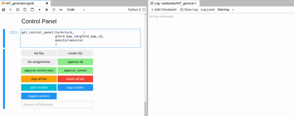
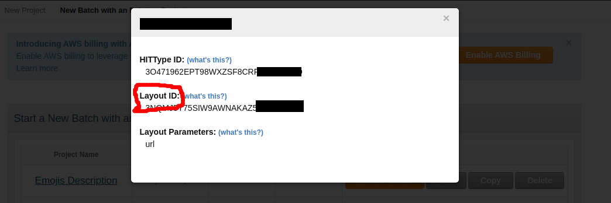

<!--
*** Thanks for checking out the Best-README-Template. If you have a suggestion
*** that would make this better, please fork the repo and create a pull request
*** or simply open an issue with the tag "enhancement".
*** Thanks again! Now go create something AMAZING! :D
***
***
***
*** To avoid retyping too much info. Do a search and replace for the following:
*** ymentha14, mturk2gform, twitter_handle, yann.mentha@gmail.com, Mturk2Gform, The flexibility of Google forms on Amazon MTurk
-->


<!-- PROJECT SHIELDS -->
<!--
*** I'm using markdown "reference style" links for readability.
*** Reference links are enclosed in brackets [ ] instead of parentheses ( ).
*** See the bottom of this document for the declaration of the reference variables
*** for contributors-url, forks-url, etc. This is an optional, concise syntax you may use.
*** https://www.markdownguide.org/basic-syntax/#reference-style-links
-->
[![Contributors][contributors-shield]][contributors-url]
[![Forks][forks-shield]][forks-url]
[![Stargazers][stars-shield]][stars-url]
[![Issues][issues-shield]][issues-url]
[![MIT License][license-shield]][license-url]
[![LinkedIn][linkedin-shield]][linkedin-url]


<!-- PROJECT LOGO -->
<br />
  <h1 align="center">Mturk2Gform</h1>

<p align="center">
  <a href="https://github.com/ymentha14/mturk2gform">
    
  </a>


  <p align="center">
    The flexibility of Google forms on Amazon MTurk
    <br />
    <a href="https://github.com/ymentha14/mturk2gform"><strong>Explore the docs »</strong></a>
    <br />
    <br />
    <a href="https://github.com/ymentha14/mturk2gform">View Demo</a>
    ·
    <a href="https://github.com/ymentha14/mturk2gform/issues">Report Bug</a>
    ·
    <a href="https://github.com/ymentha14/mturk2gform/issues">Request Feature</a>
  </p>
</p>


<!-- TABLE OF CONTENTS -->
<details open="open">
  <summary><h2 style="display: inline-block">Table of Contents</h2></summary>
  <ol>
    <li>
      <a href="#about-the-project">About The Project</a>
      <ul>
        <li><a href="#do-you-need-it">Do you need it?</a></li>
        <li><a href="#what-is-it">What is it?</a></li>
        <li><a href="#what-is-it-not">What is it not?</a></li>
      </ul>
    </li>
    <li><a href="#usage">Usage</a></li>
    <li>
      <a href="#getting-started">Getting Started</a>
      <ul>
        <li><a href="#1-prerequisites">Prerequisites</a></li>
        <li><a href="#2-installation">Installation</a></li>
        <li><a href="#3-credentials-settings">Credentials Settings</a></li>
        <li><a href="#4-forms-generation">Forms Generation</a></li>
      </ul>
    </li>
    <li><a href="#contributing">Contributing</a></li>
    <li><a href="#license">License</a></li>
    <li><a href="#contact">Contact</a></li>
  </ol>
</details>


## About the Project

### Do you need it?

✔️ You need to gather a big amount of human-labeled data.

✔️ This data should be answered on distinct forms following all a similar template, but with different questions each (image description for instance)

✔️You want to limit the number of workers answering a given form in order to guarantee diversity amongst your data source

If you still are still reading, chances are that Mturk2gform will help you saving some work/time!

### What is it?

Mturk2Gform lets you easily link  a set of generated [Google forms](https://www.google.com/forms/about/) to [Amazon Mechanical Turk ](https://www.mturk.com/)HITs, taking advantage of both frameworks benefits:

* The generative capability of [Google Appscript](https://developers.google.com/apps-script/reference/forms) to automate personalized Google forms creation.
* The robust features of Amazon MTurk to control task scheduling and workers payment.

### What is it not?
Mturk2Gform does not aim at replacing one or the other frameworks, but rather to **provide the user with a quick, scalable and reliable solution to automate human-labeled data gathering from google forms.**

It consists of a wrapper class around the [boto3](https://boto3.amazonaws.com/v1/documentation/api/latest/reference/services/mturk.html) library and various functionalities from [Google python client](https://github.com/googleapis/google-api-python-client)


*Disclaimer: Although MTurk already provides the user with forms to gather data, its features are somehow limited in comparison with what can be done in Google Forms, in particular when it comes to generate a big number of these forms. (image integration, easy linkage with other drive documents etc.)*
<!-- ### Built With

* []()
* []()
* []() -->


<!-- USAGE EXAMPLES -->
## Usage
Mturk2Gform provides you with 3 levels of control on the Mturk HITs dependingon your needs:

* **High-level interface**: a control panel based on [Ipywidgets](https://ipywidgets.readthedocs.io/en/latest/) which lets you create, list, stop delete and monitor hits conveniently


* **Mid-level interface**: The Object-Oriented implementation of Mturk2Gform presents some extra methods in addition to the control panel
* **Low-level interface**: every Mturk2Gform instance gives you full access to the underlying Mturk `boto3` client as an instance attribute: if some functionalities are missing, you can always complete them on the fly.

In addition to these three levels of control, Mturk2Gform provides you with some extra features not present in Mturk or Google Forms:

* **Monitoring of HITs**: you can limit the number of forms one worker can answer among your Google forms set

* **Template Appscript**: to automatize the generation of ilimited number of personalized Google Forms

* **Confirmation Code**: Although this feature is not native to google forms, Mturk2Gform implements a confirmation code features ensuring that workers indeed completed your forms


For other examples and features, please refer to the [Documentation](https://example.com)


<!-- GETTING STARTED -->
## Getting Started

### 1. Prerequisites

```
python >= 3.6
```
<!-- or
```
docker >= 3.6
``` -->
### 2. Installation
Using pip
```sh
pip install mt2gf
jupyter labextension install @jupyter-widgets/jupyterlab-manager
```
<!-- 
Using docker
```sh
docker run mt2gf -v TODO: complete
``` -->

Cloning the repo
```sh
git clone https://github.com/ymentha14/mturk2gform.git
```
### 3. Credentials Settings

#### Amazon Credentials
It is assumed that you already possess an AWS account: if this is not the case you can set it up [here](TODO:complete)

Once this is done, you need to download your public and secret key into a .csv file as described [here](https://docs.aws.amazon.com/powershell/latest/userguide/pstools-appendix-sign-up.html#get-access-keys). These keys will allow mt2gf to connect to your AWS account and help you managing the HITs.

#### Google Credentials
You need to set up the Google [People API](https://developers.google.com/people/quickstart/python) associated with your Google Drive account to establish the link with Mturk2Gform: once you are done, you can save the `credentials.json` file.

### 4. Forms Generation
### Google Appscript
Mt2gf assumes you generated a serie of google forms (for ex. using [Appscript](https://developers.google.com/apps-script/reference/forms) ) present on a Google Drive folder along with a `gform_mapping.txt` file whose rows respect the following structure:
```
<form index>,<url to form>,<url to form spreadsheet>
```
Tipp: An [Appscript template]() is provided to help you creating the form and linking the forms to their respective spreadsheets.

#### MTurk HIT Layout
The MTurk layout will have to describe what your task consists in: it is on this layout that the url to the google form wil appear. To make this hitlayout compatible with Mturk2gform, enter `${url}` where you want the link to appear. (Detailed explanations [here](https://blog.mturk.com/tutorial-editing-your-task-layout-5cd88ccae283)). Save the changes, selet your task and save the hitlayout_id that shows up when clicking on your task:

___

Once these 4 steps are done, you can start running a [template mt2gf notebook]() with your own data to familiarize with the framework.


Project Structure
------------


    ├── LICENSE
    ├── README.md <-- The README you're currently reading
    ├── Dockerfile <-- Dockerfile
    ├── requirements.txt <-- python packages required for mt2gf
    ├── setup.py <-- setuptools script
    ├── bash_scripts
    │   └── jupy_ext.sh <-- Script to install IPywidgets extensions
    ├── docs <-- Sphinx documentation ofthe project
    ├── Makefile
    ├── mt2gf
    │   ├── appscript
    │   │   ├── appscript_template.js
    │   │   └── mouse_clicker_appscript.sh
    │   ├── auto_drive.py
    │   ├── auto_mturk.py
    │   ├── constants.py
    │   ├── fraudulous.py
    │   ├── preprocess.py
    │   ├── turk_widgets.py
    │   ├── utils.py
    │   └── watcher.py
    ├── notebooks
    │   └── HIT_generator.ipynb
    ├── test_environment.py
    └── tox.ini


--------


<!-- CONTRIBUTING -->
## Contributing

Contributions are what make the open source community such an amazing place to be learn, inspire, and create. Any contributions you make are **greatly appreciated**.

1. Fork the Project
2. Create your Feature Branch (`git checkout -b feature/AmazingFeature`)
3. Commit your Changes (`git commit -m 'Add some AmazingFeature'`)
4. Push to the Branch (`git push origin feature/AmazingFeature`)
5. Open a Pull Request


<!-- LICENSE -->
## License

Distributed under the MIT License. See `LICENSE` for more information.


<!-- CONTACT -->
## Contact

Your Name  - yann.mentha@gmail.com

Project Link: [https://github.com/ymentha14/mturk2gform](https://github.com/ymentha14/mturk2gform)


<!-- MARKDOWN LINKS & IMAGES -->
<!-- https://www.markdownguide.org/basic-syntax/#reference-style-links -->
[contributors-shield]: https://img.shields.io/github/contributors/ymentha14/repo.svg?style=for-the-badge
[contributors-url]: https://github.com/ymentha14/repo/graphs/contributors
[forks-shield]: https://img.shields.io/github/forks/ymentha14/repo.svg?style=for-the-badge
[forks-url]: https://github.com/ymentha14/repo/network/members
[stars-shield]: https://img.shields.io/github/stars/ymentha14/repo.svg?style=for-the-badge
[stars-url]: https://github.com/ymentha14/repo/stargazers
[issues-shield]: https://img.shields.io/github/issues/ymentha14/repo.svg?style=for-the-badge
[issues-url]: https://github.com/ymentha14/repo/issues
[license-shield]: https://img.shields.io/github/license/ymentha14/repo.svg?style=for-the-badge
[license-url]: https://github.com/ymentha14/repo/blob/master/LICENSE.txt
[linkedin-shield]: https://img.shields.io/badge/-LinkedIn-black.svg?style=for-the-badge&logo=linkedin&colorB=555
[linkedin-url]: https://linkedin.com/in/ymentha14
